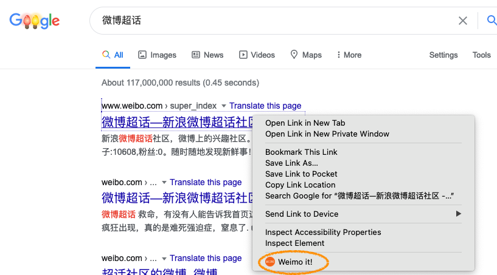
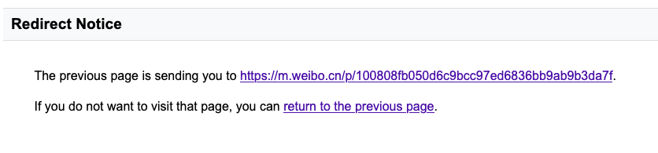

# 
Tiny firefox extension that opens Weibo pages in the mobile version so that login is not required to view content.

## Installation
Install via [Firefox add-ons](https://addons.mozilla.org/en-US/firefox/addon/weimo/)

## How To Use It
Once the extension is installed, right click on a weibo link. In the dropdown menu, 
select 'Weimo it!' and the mobile version of the link will be opened in a new tab.

You may get a redirect notice. In that case, just click the link in the notice. 

## What It Does
Replace 'www.weibo.com' or 'weibo.com' in the urls with 'm.weibo.cn' and open the updated url in a new tab. 
Links that contain 's.weibo.com' can be viewed in the web version without logging in and will not be updated by Weimo. 

## What It Does Not Do
Weibo would still force signing in after viewing content in the mobile version for some time. Weimo does not provide a work-around for that at this moment.